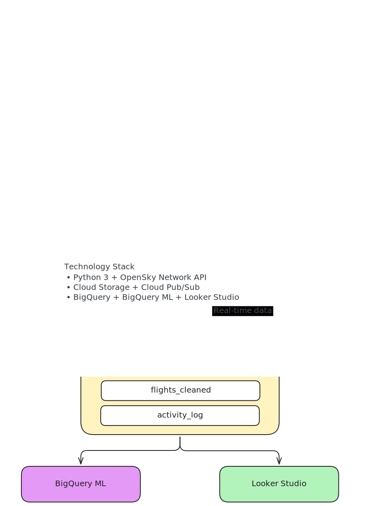

# FlightTracker ✈️

**Real-Time Air Traffic Analytics Pipeline on Google Cloud Platform**

A Big Data pipeline that ingests, processes, and visualizes global flight data from the [OpenSky Network API](https://openskynetwork.github.io/opensky-api/) using batch and streaming architectures.

## Architecture



## Tech Stack

| Component | Technology | Purpose |
|-----------|-----------|---------|
| Language | Python 3 | All scripts |
| Data Source | OpenSky Network API | Real-time flight data (free, no key) |
| Message Queue | Cloud Pub/Sub | Decouple producer and consumer |
| Data Lake | Cloud Storage | Raw data archive |
| Data Warehouse | BigQuery | Analytics and ML |
| Machine Learning | BigQuery ML (KMeans) | Anomaly detection |
| Dashboard | Looker Studio | Interactive visualizations |

## Project Structure

```
flight-tracker/
├── config/
│   ├── settings.py          # Central configuration (loads .env)
│   ├── schema.json          # BigQuery table schema
│   └── gcp_setup.md         # Step-by-step lab setup guide
├── src/
│   ├── batch_ingestion.py   # Batch: API → Cloud Storage → BigQuery
│   ├── stream_ingestion.py  # Stream: API → Pub/Sub (producer)
│   ├── subscriber.py        # Stream: Pub/Sub → BigQuery (consumer)
│   └── data_cleaning.py     # ETL: clean, transform, deduplicate
├── sql/
│   ├── queries.sql          # Analysis queries (Objetivo 1)
│   └── ml_model.sql         # BigQuery ML anomaly detection (Objetivo 2)
├── docs/
│   ├── flight-tracker-architecture.svg        # Architecture diagram
│   └── flight-tracker-architecture.excalidraw # Editable source
├── setup.py                 # One-time GCP infrastructure setup
├── run_pipeline.py          # Orchestrator: runs entire pipeline at once
├── .env.example             # Template for environment variables
├── requirements.txt         # Python dependencies
├── .gitignore               # Excludes credentials and data
└── README.md                # This file
```

## Quick Start

### Prerequisites
- Google Cloud Platform account (or lab access)
- Python 3.9+
- Service account with BigQuery, Pub/Sub, and Storage roles

### Setup

```bash
# 1. Clone the repo
git clone https://github.com/Moya-Art/Flight-Tracker.git
cd Flight-Tracker

# 2. Install dependencies
pip install -r requirements.txt

# 3. Create .env from template
cp .env.example .env
# Edit .env with your GCP project ID and credentials path

# 4. Create GCP infrastructure
python setup.py
```

### Run the Pipeline

**Option A: All at once (recommended)**
```bash
# Runs: setup → batch ingestion → streaming (10 min) → cleaning
python run_pipeline.py --stream-minutes 10
```

**Option B: Step by step**
```bash
# Terminal 1: Start the streaming producer
python src/stream_ingestion.py

# Terminal 2: Start the subscriber
python src/subscriber.py

# Terminal 3: Run batch ingestion (one-time historical load)
python src/batch_ingestion.py

# Terminal 4: Run data cleaning/transformation
python src/data_cleaning.py
```

### Run Analysis

1. Open [BigQuery Console](https://console.cloud.google.com/bigquery)
2. Run queries from `sql/queries.sql` (flight pattern analysis)
3. Run queries from `sql/ml_model.sql` (anomaly detection model)

### Create Dashboard

1. Open [Looker Studio](https://lookerstudio.google.com/)
2. Connect to BigQuery dataset `flight_tracker.flights_cleaned`
3. Create visualizations:
   - Map of active flights
   - Flights by hour of day
   - Top countries by flight count
   - Anomaly detection results

## Research Objectives

### Objective 1: Flight Pattern Analysis
**Question:** What are the most congested air routes by geographic zone and time of day?

**Method:** SQL aggregation queries in BigQuery with GROUP BY, window functions, and time-based analysis.

### Objective 2: Anomaly Detection with Machine Learning
**Question:** Can we detect flights with anomalous behavior using machine learning?

**Method:** BigQuery ML KMeans clustering model that groups flights by speed, altitude, and vertical rate. Flights far from their cluster center are flagged as anomalies.

## Data Source

[OpenSky Network](https://opensky-network.org/) — Free, real-time air traffic data.

- **API:** REST endpoint, no authentication required for basic use
- **Data:** Aircraft position, altitude, speed, heading, country of origin
- **Update frequency:** ~5-15 seconds
- **Coverage:** Global (all aircraft broadcasting ADS-B)

## Environment Variables

Copy `.env.example` to `.env` and fill in:

```env
GCP_PROJECT_ID=your-project-id
GCP_REGION=us-central1
GOOGLE_APPLICATION_CREDENTIALS=config/service-account-key.json
```

## License

This project is for academic purposes (DuocUC — Big Data course).

## Author

**Arturo Orlando Moya Ibarra**
- GitHub: [@Moya-Art](https://github.com/Moya-Art)
- LinkedIn: [Arturo Moya](https://linkedin.com/in/arturo-moya)
